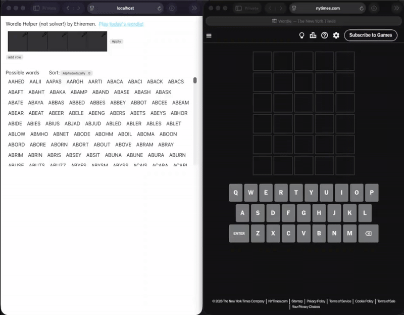

# Wordle helper/companion by Ehiremen

This project was bootstrapped with [Create React App](https://github.com/facebook/create-react-app) and runs on http://localhost:3000 when ran locally (`npm run start`).

## About

- Companion (not a solver!) for the NewYorkTimes' [Wordle](https://www.nytimes.com/games/wordle/index.html) game.
    - the "dictionary" was sourced from https://www.nytimes.com/games-assets/v2/wordle.01277c06b8349a28c4ed9a9282e0b205c6b00cf8.js and may be out of date
    - if you have a suggestion/improvement regarding the dictionary, either raise a pr or contact me on [LinkedIn](https://linkedin.com/in/Ehiremen)
- The dictionary gets updated -- to remove invalid words -- as the user inputs the results of their guesses
    - the dictionary can be sorted either:
        - alphabetically, which is your regular A-Z sort; or
        - by "best guess," which sorts by number of unique letters in the word.
- On clicking "Apply" on any row, cells in that row get locked for editing, and the list of valid guesses gets updated.

## Demo

